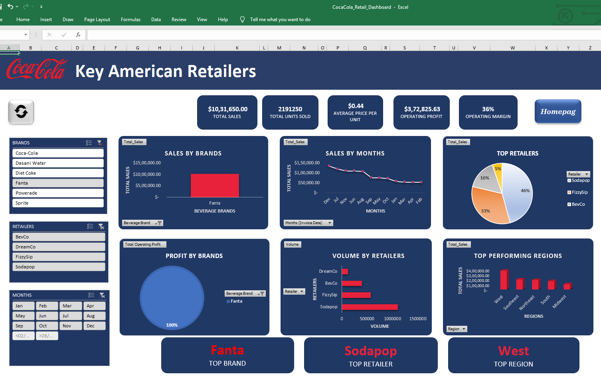
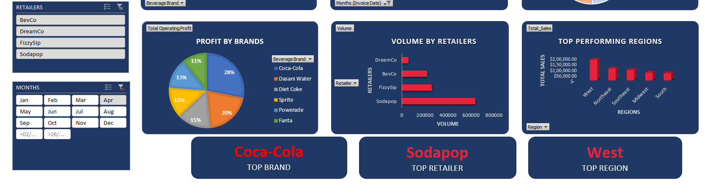

# 🥤 Coca-Cola Retail Sales Dashboard

## 📌 Project Overview

The Coca-Cola Retail Sales Dashboard is an interactive Business Intelligence solution developed in Microsoft Excel using VBA, Pivot Tables, Pivot Charts, and Slicers. The dashboard enables users to analyze retail sales performance, monitor key business metrics, and gain actionable insights through dynamic visualizations and automated reporting.

The project demonstrates expertise in Excel-based analytics, dashboard design, automation, and business reporting.

---

## Dashboard Preview

### Dashboard Overview

> 

---


## 🎯 Business Objective

Retail businesses generate large volumes of transactional data across multiple products, retailers, and regions. Analyzing this data manually can be time-consuming and prone to errors.

This dashboard was developed to:

* Automate sales reporting processes
* Provide real-time business insights
* Improve decision-making through data visualization
* Enable interactive analysis using filters and slicers
* Reduce manual effort in report generation

---

## 📊 Dashboard Features

### Executive KPI Dashboard

* Interactive KPI Cards
* Sales Performance Monitoring
* Trend Analysis
* Comparative Analysis

### Interactive Filtering

Users can filter reports dynamically using:

* Beverage Brand
* Retailer
* Invoice Month

### Automated Data Refresh

One-click refresh updates:

* Pivot Tables
* Charts
* KPI Metrics
* Dashboard Reports

### Enhanced User Experience

VBA automation is used to:

* Hide Excel Ribbon
* Hide Gridlines
* Hide Worksheet Tabs
* Open directly on the Homepage
* Provide a dashboard-like interface

---

# 🏗️ Solution Architecture

```text
                    +-------------------+
                    |   Source Data     |
                    | Retail Sales Data |
                    +---------+---------+
                              |
                              v
                    +-------------------+
                    |   Pivot Tables    |
                    | Data Aggregation  |
                    +---------+---------+
                              |
                              v
                    +-------------------+
                    | Pivot Charts      |
                    | KPI Calculations  |
                    +---------+---------+
                              |
                              v
                    +-------------------+
                    | Dashboard Layer   |
                    | Visual Analytics  |
                    +---------+---------+
                              |
                              v
                    +-------------------+
                    | VBA Automation    |
                    | Refresh & Control |
                    +-------------------+
```

---

## 📂 Workbook Structure

| Sheet Name  | Description                             |
| ----------- | --------------------------------------- |
| Homepage    | Landing page and dashboard navigation   |
| Dashboard   | Interactive KPI and visualization layer |
| Analysis    | Detailed sales analysis and trends      |
| Pivot Table | Backend aggregation engine              |
| Source Data | Raw retail sales dataset                |

---

## ⚙️ VBA & Macros Used

### Workbook_Open()

Purpose:

* Opens workbook on Homepage
* Displays welcome message
* Configures dashboard mode
* Customizes Excel interface

Example:

```vb
Private Sub Workbook_Open()

Worksheets("Homepage").Activate

MsgBox "Welcome to the Coca Cola Retail Dashboard"

End Sub
```

---

### Workbook_Deactivate()

Purpose:

* Restores Excel settings
* Re-enables Ribbon and standard interface options

---

### Refresh_button_click()

Purpose:

* Refresh all Pivot Tables
* Update Dashboard Visuals
* Clear active slicer filters

Example:

```vb
Sub Refresh_button_click()

ActiveWorkbook.RefreshAll

ActiveWorkbook.SlicerCaches("Slicer_Beverage_Brand").ClearManualFilter
ActiveWorkbook.SlicerCaches("Slicer_Retailer").ClearManualFilter
ActiveWorkbook.SlicerCaches("Slicer_Months__Invoice_Date").ClearManualFilter

End Sub
```

---

## 📈 Key Insights Generated

The dashboard helps stakeholders:

* Monitor total sales performance
* Analyze beverage brand trends
* Compare retailer performance
* Track monthly sales patterns
* Identify top-performing segments
* Support business decision-making

---

## 🛠️ Technology Stack

| Technology      | Purpose                             |
| --------------- | ----------------------------------- |
| Microsoft Excel | Dashboard Development               |
| VBA             | Automation & User Interface Control |
| Pivot Tables    | Data Aggregation                    |
| Pivot Charts    | Visualization                       |
| Slicers         | Interactive Filtering               |
| Excel Macros    | Report Automation                   |

---

# 📷 Dashboard Screenshots

## Dashboard Filters and Slicers

> Filter is applied on Brands Slicer shows retail reports for Fanta

> 

---

## Dashboard Analysis

> In the month of April the most profitable brand is Coca Cola and the Top Retailer is Soda Pop.

> 

---

## 🧠 Skills Demonstrated

* Data Analysis
* Business Intelligence
* Dashboard Development
* Excel VBA
* Data Visualization
* KPI Reporting
* Report Automation
* Sales Analytics
* Problem Solving
* Stakeholder Reporting

---

## 🚀 Future Enhancements

* SQL Database Integration
* Power BI Migration
* Automated Email Reporting
* Forecasting & Predictive Analytics
* Machine Learning-Based Demand Forecasting

---

