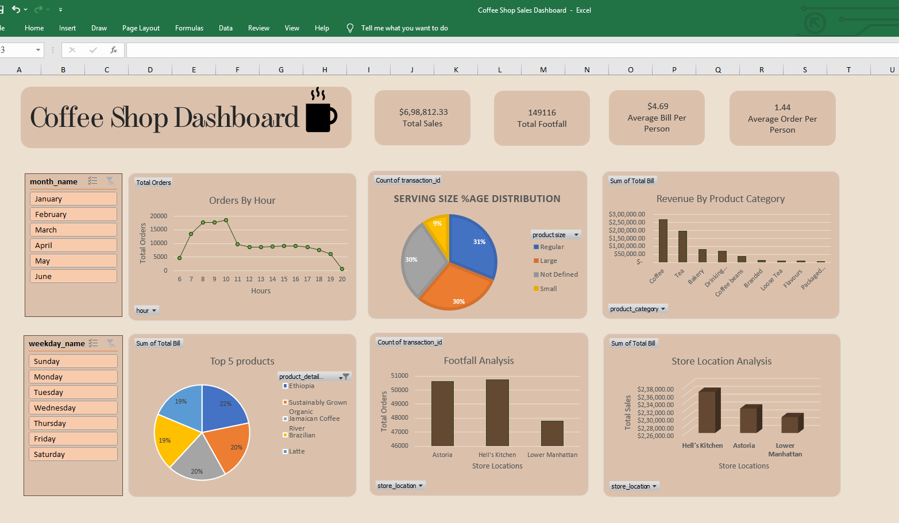
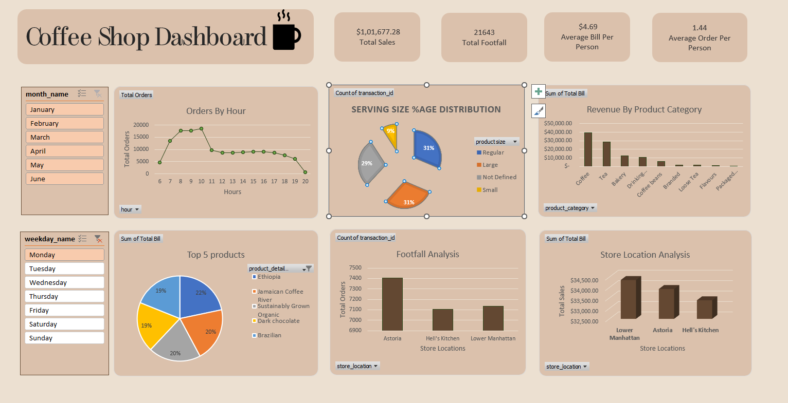

# ☕ Coffee Shop Sales Dashboard (Excel Project)

## 📌 Project Overview

This project is an interactive Coffee Shop Sales Dashboard built in Microsoft Excel to analyze sales performance across different store locations, product categories, and time periods.

The dashboard transforms raw transactional data into meaningful business insights through Pivot Tables, KPI Cards, Charts, and Slicers, enabling stakeholders to monitor sales trends and make data-driven decisions.

---

# 📊 Dashboard Preview

## Main Dashboard

Dashboard Overview



---

## Interactive Filters & Slicers

Filter added to Weekday Slicer and shows the sales on Monday 



---

# 🎯 Business Objective

The primary objectives of this dashboard are:

- Monitor overall sales performance.
- Analyze customer purchasing behavior.
- Identify top-selling products.
- Evaluate store performance.
- Discover peak business hours.
- Compare monthly sales trends.
- Support strategic business decisions.

---

# 📂 Dataset Information

### Source

Coffee Shop Sales Transaction Dataset

### Total Records

149,116 Transactions

### Data Fields

| Column Name | Description |
|------------|-------------|
| transaction_id | Unique transaction identifier |
| transaction_date | Date of purchase |
| transaction_time | Time of purchase |
| transaction_qty | Quantity purchased |
| store_id | Store identifier |
| store_location | Store location |
| product_id | Product identifier |
| unit_price | Price per item |
| product_category | Product category |
| product_type | Product type |
| product_detail | Product description |
| Total Bill | Total transaction amount |
| month_name | Month of transaction |
| weekday_name | Day of transaction |
| hour | Purchase hour |

---

# 🛠 Tools & Technologies Used

- Microsoft Excel
- Pivot Tables
- Pivot Charts
- Slicers
- KPI Cards
- Conditional Formatting
- Data Cleaning
- Excel Functions & Formulas

---

# 🔄 Data Preparation

## Data Cleaning

The following preprocessing activities were performed:

- Removed missing and inconsistent records.
- Validated transaction details.
- Standardized date and time formats.
- Checked data quality and duplicates.

## Feature Engineering

Additional analytical columns were created:

- Month Name
- Month Number
- Weekday Name
- Hour
- Total Bill

### Formula Used

```excel
=Transaction_Qty * Unit_Price
```

Used to calculate Total Bill for each transaction.

---

# 📈 Key Performance Indicators (KPIs)

## Total Sales

Measures overall revenue generated.

```excel
=SUM(Total_Bill)
```

---

## Total Orders

Measures total number of transactions.

```excel
=COUNT(Transaction_ID)
```

---

## Total Quantity Sold

Measures total units sold.

```excel
=SUM(Transaction_Qty)
```

---

## Average Order Value

Measures average revenue generated per order.

```excel
=Total Sales / Total Orders
```

---

# 📊 Dashboard Components

## 1. Monthly Sales Trend Analysis

Purpose:

Analyze revenue trends across months.

Insights:

- Revenue growth trends
- Seasonal demand patterns
- Month-over-month comparison

---

## 2. Hourly Sales Analysis

Purpose:

Understand customer purchasing behavior throughout the day.

Insights:

- Peak business hours
- Customer traffic patterns
- Workforce planning opportunities
---

## 3. Product Category Performance

Purpose:

Compare sales contribution across product categories.

Categories:

- Coffee
- Tea
- Bakery
- Drinking Chocolate
- Flavours
- Packaged Products

Insights:

- Best-selling categories
- Revenue contribution by category
- Product demand trends

---

## 4. Store Performance Analysis

Purpose:

Compare sales performance across store locations.

Locations:

- Hell's Kitchen
- Astoria
- Lower Manhattan

Insights:

- Highest-performing store
- Revenue contribution by location
- Transaction comparison across stores

---

# 📌 Key Insights

### Revenue Performance

- Generated over $698K in total sales.
- Consistent month-over-month revenue growth observed.

### Product Insights

- Coffee contributed the largest share of revenue.
- Tea emerged as the second-highest selling category.

### Store Insights

- Hell's Kitchen recorded the highest sales performance.
- Astoria maintained strong transaction volume.
- Lower Manhattan demonstrated consistent revenue generation.

### Customer Behavior

- Majority of transactions occurred during morning and afternoon hours.
- Customer demand followed a predictable daily pattern.

---

# 💡 Business Recommendations

### Product Strategy

- Promote top-selling coffee products.
- Create combo offers with bakery products.

### Inventory Management

- Increase inventory during peak demand hours.
- Use historical sales data for forecasting.

### Staffing Optimization

- Schedule more staff during busy hours.
- Align workforce planning with customer traffic patterns.

### Business Expansion

- Replicate successful sales strategies across all locations.
- Evaluate expansion opportunities based on high-performing stores.

---

# 📁 Project Structure

```text
Coffee Shop Sales Dashboard.xlsx

│
├── Transactions Sheet
│   ├── Raw Sales Data
│   └── Calculated Fields
│
├── Pivot Tables Sheet
│   ├── KPI Calculations
│   ├── Aggregated Reports
│   └── Supporting Tables
│
└── Dashboard Sheet
    ├── KPI Cards
    ├── Charts
    ├── Slicers
    └── Interactive Reports
```

---

# 🚀 Skills Demonstrated

## Technical Skills

- Microsoft Excel
- Pivot Tables
- Pivot Charts
- Dashboard Design
- Data Cleaning
- Data Analysis
- Data Visualization

## Analytical Skills

- Sales Analytics
- KPI Reporting
- Trend Analysis
- Customer Behavior Analysis
- Business Intelligence
- Performance Monitoring

---

# 👤 Author
