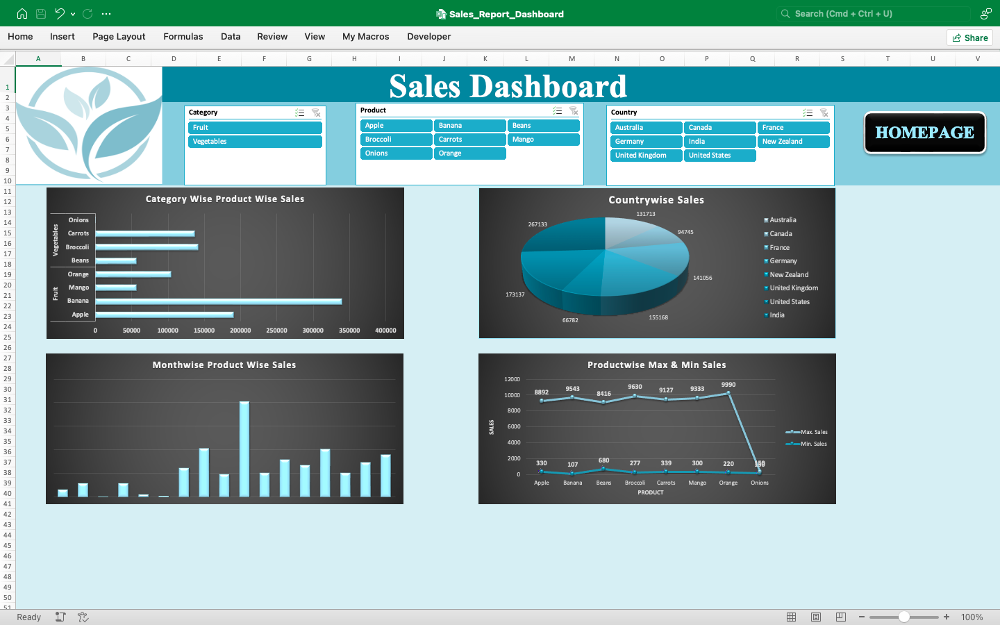
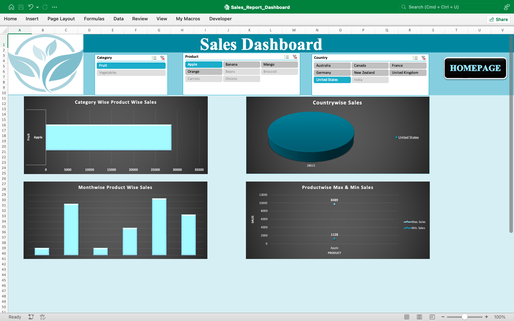
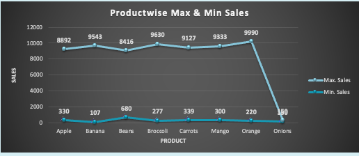

# 📊 Sales Report Dashboard | Advanced Excel Project

## Overview

This project presents an interactive **Sales Report Dashboard** developed using **Microsoft Excel (Advanced Excel)**. The dashboard provides a comprehensive analysis of sales performance through dynamic visualizations, KPI tracking, Pivot Tables, Pivot Charts, and interactive slicers.

The objective of this project is to transform raw sales data into actionable business insights, enabling stakeholders to monitor performance, identify trends, and support data-driven decision-making.

---

## Dashboard Preview

### Dashboard Overview




---

### Interactive Filters & Slicers

> Sales Dashboard for Apple in United States




---

### Sales Analysis View

> Maximum Sales has declined for Onions in Vegetables


---

## Business Objectives

* Monitor overall sales performance
* Analyze revenue trends over time
* Identify top-performing products and categories
* Evaluate regional sales performance
* Support business decision-making through interactive reporting

---

## Tools & Technologies

* Microsoft Excel
* Pivot Tables
* Pivot Charts
* Slicers
* Conditional Formatting
* Data Validation
* Advanced Excel Formulas
* Dashboard Design & Visualization
* VBA / Macros

---

## Key Features

### KPI Tracking

The dashboard tracks important business metrics such as:

* Total Sales
* Revenue
* Number of Orders
* Product Performance
* Regional Performance

### Interactive Dashboard

Users can dynamically filter and analyze data using slicers and interactive controls.

### Sales Trend Analysis

Visual representations help identify monthly and yearly sales trends.

### Product Performance Analysis

Highlights best-performing and underperforming products based on sales metrics.

### Regional Insights

Provides comparisons across regions to identify growth opportunities and business performance patterns.

---

## Project Workflow

### 1. Data Collection

Collected and organized raw sales transaction data.

### 2. Data Cleaning

Performed data validation, formatting, and preprocessing to ensure data accuracy.

### 3. Data Transformation

Used Excel functions and Pivot Tables to prepare data for analysis.

### 4. Dashboard Development

Designed interactive visualizations, KPI cards, charts, and slicers.

### 5. Business Analysis

Generated actionable insights to support strategic decision-making.

---

## Skills Demonstrated

* Data Analysis
* Data Cleaning
* Data Visualization
* Dashboard Development
* Business Intelligence Reporting
* Excel Automation
* Analytical Thinking
* Problem Solving

---

## Project Structure

```text
sales-report-dashboard-excel/
│
├── Sales_Report_Dashboard.xlsm
├── README.md
│
└── screenshots/
    ├── dashboard-overview.png
    ├── dashboard-filters.png
    └── dashboard-analysis.png
```

---

## Key Insights

The dashboard can be used to answer business questions such as:

* Which products generate the highest sales?
* Which regions contribute the most revenue?
* How does sales performance vary over time?
* What are the top-performing product categories?
* Which business segments require improvement?

---

## Future Enhancements

* Power BI version of the dashboard
* SQL database integration
* Sales forecasting using Python and Machine Learning
* Customer segmentation analysis

---

## Author

**Reshma**

Aspiring Data Scientist with skills in:

* Advanced Excel
* SQL
* Python
* Power BI
* Statistics
* Machine Learning
* MongoDB

This project demonstrates the ability to transform business data into meaningful insights through effective dashboard design and analytical reporting.

---
